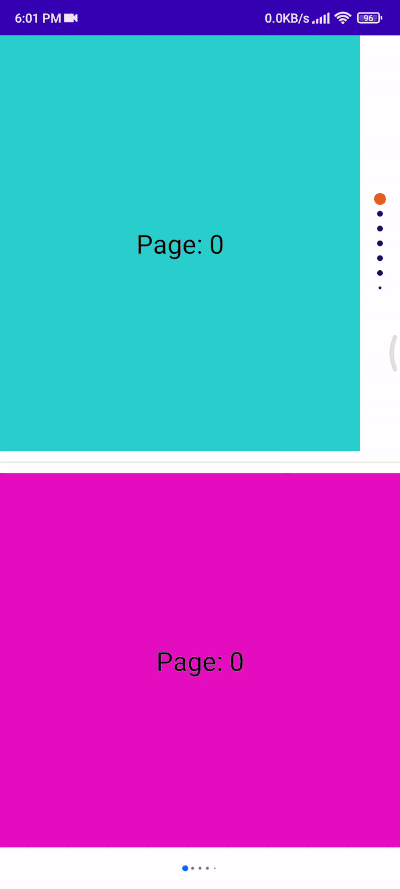

<h1 align="center"> Pager Indicator </h1>
<p align="center">
  <a href="https://www.linkedin.com/in/talhatek/"></a>
  <a href="https://opensource.org/licenses/Apache-2.0"></a>
  <a href="https://jitpack.io/#talhatek/pager_indicator"></a>
</p>

## Demo


# How to use

Add below codes to your **root** `build.gradle` file.
```gradle
allprojects {
 repositories {
   maven { url 'https://jitpack.io' }
  }
}

```
And add a dependency code to your **module**'s `build.gradle` file.

Compose 1.1 (1.1.x)
```gradle
implementation 'com.github.talhatek:pager_indicator:1.0'
```


Compose 1.2 (1.2.x)
```gradle
implementation 'com.github.talhatek:pager_indicator:2.1'
```
You can call **PagerIndicator** inside your composable content.
```kotlin
PagerIndicator(
  modifier = Modifier,
  pagerState = pagerState,
  dotStyle = DotStyle.defaultDotStyle,
  dotAnimation = DotAnimation(),
  orientation = Orientation.Vertical
 )
```
# Customization

| Attribute           | Note                                      | Default     |
|---------------------|-------------------------------------------|-------------|
| orientation         | Indicator Orientation                     | Vertical    |
| currentDotRadius    | Current dot radius                        | 8f          |
| notLastDotRadius    | Not last edge dot radius                  | 2f          |
| regularDotRadius    | Regular dot radius                        | 4f          |
| dotMargin           | Space between dots                        | 12f         |
| visibleDotCount     | Max visible dot count                     | 5           |
| currentDotColor     | Current dot color                         | #0d6efd     |
| regularDotColor     | Regular dot color                         | #6c757d     |
| sizeAnim            | Size change  animation                    | spring      |
| offsetAnim          | Offset change  animation                  | spring      |
| colorAnim           | Color change  animation                   | spring      |

# License
```xml
Designed and developed by 2022 talhatek
Licensed under the Apache License, Version 2.0 (the "License");
you may not use this file except in compliance with the License.
You may obtain a copy of the License at

   http://www.apache.org/licenses/LICENSE-2.0

Unless required by applicable law or agreed to in writing, software
distributed under the License is distributed on an "AS IS" BASIS,
WITHOUT WARRANTIES OR CONDITIONS OF ANY KIND, either express or implied.
See the License for the specific language governing permissions and
limitations under the License.
```
